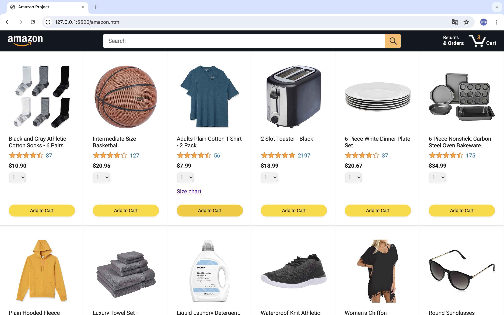
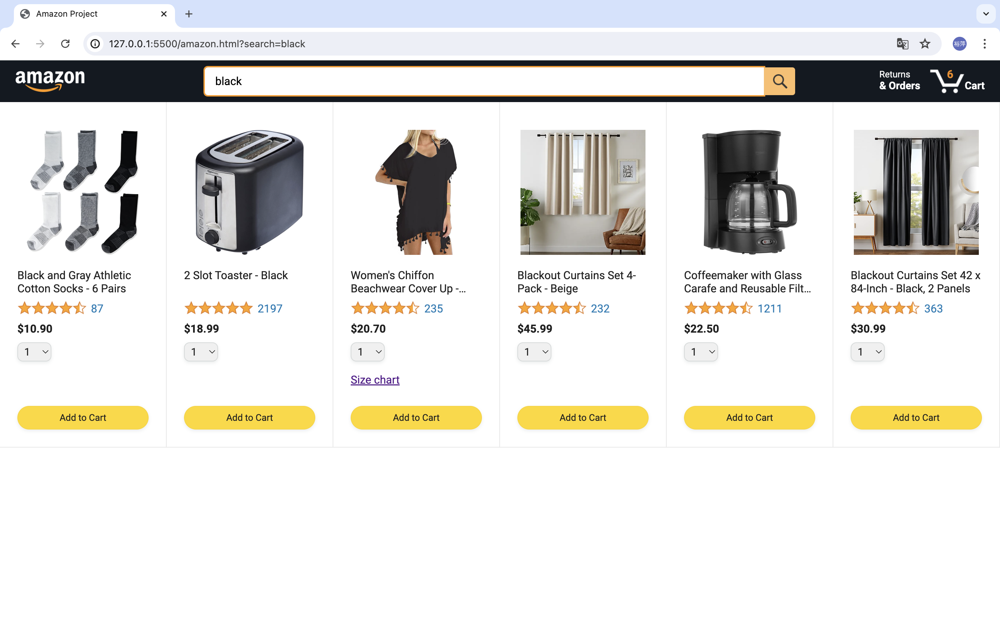
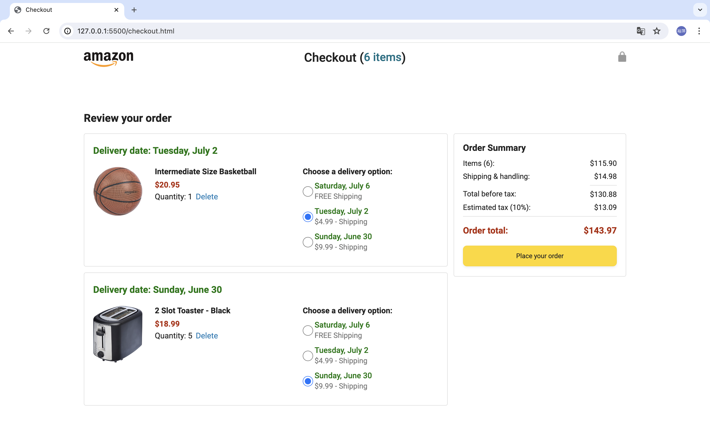
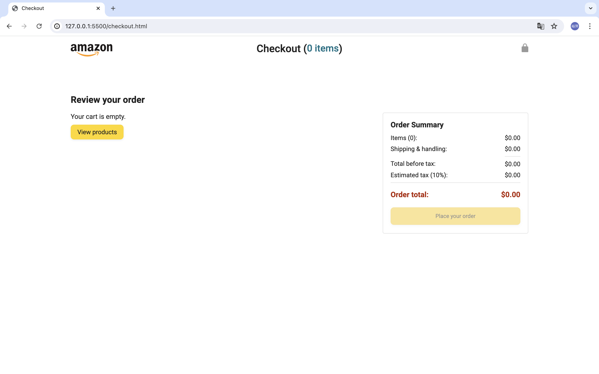
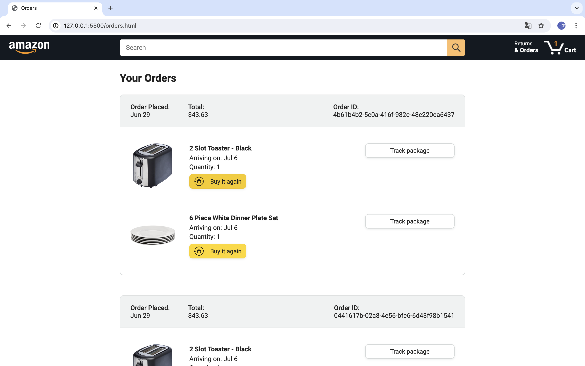
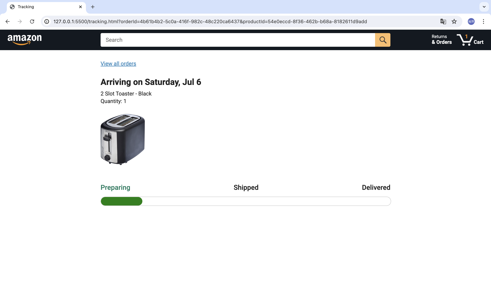

# Javascript-Amazon-Project

## Description

To deepen my knowledge in software engineering, I completed a 22-hour JavaScript full course on YouTube and built this Amazon shopping website.

## Usage

1. Download the code to your local machine.
2. Open `amazon.html` using Live Server.

## Features

### Amazon.html (Homepage)

- **Search Bar**: Displays products whose names or category tags match the keyword.
- **Added Icon**: Appears for 1 second after pressing "Add to Cart" button.
- **Cart Button**: Transitions to the orders page when clicked.

### Orders.html (Order Page)

- **Delivery Options**: Users can choose from three delivery options, with related data updates.
- **Delete Button**: Removes products when clicked.
- **Place Your Order Button**: Transitions to the checkout page if there are items in the order. If no items are selected, the button will become disabled and its opacity will increase.
- **View Products Button**: Appears when all products are removed; returns to the homepage when clicked.

### Checkout.html (Checkout Page)

- **Buy It Again Button**: Allows users to add previously ordered products directly to the cart.
- **Track Package Button**: Transitions to the tracking page.

### Tracking.html (Tracking Page)

- **Delivery Progress Bar**: Calculates and displays current progress of product delivery status.
- **Current Status Highlight**: Highlights current status with green font.
- **View All Products Link**: Returns to the homepage.

### UI Snapshots
**Homepage** 

**Homepage - search bar**

**Order Page**

**Order Page - with place your order button disabled**

**Checkout Page**

**Tracking Page**

## Acknowledgements

I learned from the free JavaScript course provided by SuperSimpleDev channel.
Big thanks to SuperSimpleDev's JavaScript full course!
Course Link: [SuperSimpleDev JavaScript Full Course](https://www.youtube.com/watch?v=EerdGm-ehJQ&t=54s)

